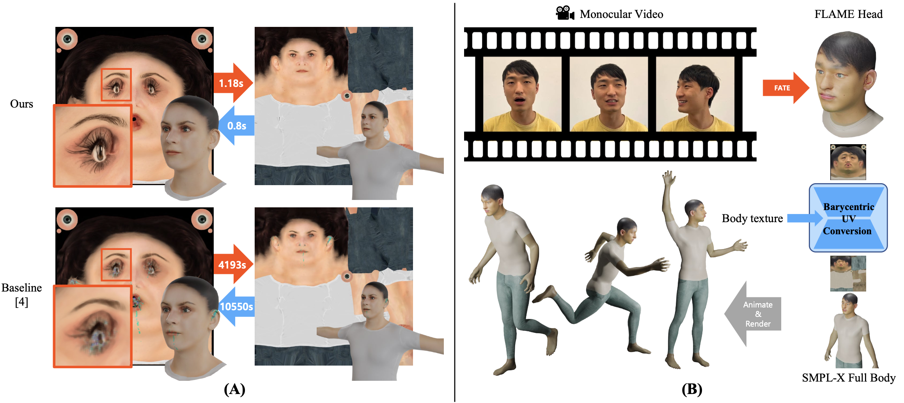

# Fast Texture Transfer for XR Avatars via Barycentric UV Conversion



[**Paper**](https://arxiv.org/abs/2508.19518) · [**DOI**](https://doi.org/10.48550/arXiv.2508.19518)

Contact : hail96@kaist.ac.kr

---

## Abstract

**Fast Texture Transfer for XR Avatars via Barycentric UV Conversion**  
*[**Hail Song**](), Seokhwan Yang, Woontack Woo*

We present a fast and efficient method for transferring facial textures onto SMPL-X-based full-body avatars. Unlike conventional affine-transform methods that are slow and prone to visual artifacts, our method utilizes a barycentric UV conversion technique. Our approach precomputes the entire UV mapping into a single transformation matrix, enabling texture transfer in a single operation. This results in a speedup of over 7000x compared to the baseline, while also significantly improving the final texture quality by eliminating boundary artifacts. Through quantitative and qualitative evaluations, we demonstrate that our method offers a practical solution for personalization in immersive XR applications. The code is available online.  
**Subjects:** Graphics (cs.GR); Computer Vision and Pattern Recognition (cs.CV)  
**Cite as:** arXiv:2508.19518 [cs.GR] (or arXiv:2508.19518v1 [cs.GR] for this version)

---

## Installation

```bash
pip install torch numpy opencv-python tqdm
```


## Data & Templates
Download these two `.npz` file and move to the `./data`folder.
[Source link](https://drive.google.com/drive/folders/1nK64eovg86SuUiTtTf8I__IknvXXVgHE?usp=sharing)


This repo provides:

- `convert_example.py` — example usage to apply a **precomputed** UV grid
- `generate_map.py` — builds the reusable UV grid (barycentric UV conversion)

---

## Quick Start

### A) Run the conversion example (first)

Use an existing UV grid to transfer a FLAME face texture onto a SMPL-X texture:

The sample code for round-conversion (SMPL-X to FLAME to SMPL-X)is at `convert_example.py`


```
# in convert_eample.py
# FLAME to SMPLX conversion
flame_texture_path = "./input/song.png"
smplx_texture_path = "./input/smplx_sample_1.png"
output_dir = "./output/"

smplx_flame_uv_grid_path = f"./data/smplx_flame_uv_grid.npz"
flame_smplx_uv_grid_path = f"./data/flame_smplx_uv_grid.npz"

# FLAME to SMPLX conversion
texture_output = ftx.flame_smplx_texture_combine(
    flame_texture_path,
    smplx_texture_path,
    uv_grid_load_path=flame_smplx_uv_grid_path,
    uv_grid_save_path=flame_smplx_uv_grid_path
)
output_path = os.path.join(output_dir, "flame_to_smplx.png")
cv2.imwrite(output_path, texture_output)


# SMPLX to FLAME conversion
mean_texture = "./data/mean_texture.jpg" # Dummy texture for FLAME
texture_output = ftx.smplx_flame_texture_combine(
    smplx_texture_path,
    mean_texture,
    uv_grid_load_path=smplx_flame_uv_grid_path,
    uv_grid_save_path=smplx_flame_uv_grid_path
)


```


Or you can create ./data/flame2smplx_grid.npz with step B.


### B) Generate a UV map (grid)

generate_map.py builds a reusable .npz grid.
Required files for this step:

- smplx_obj = ./data/smplx-addon.obj — SMPL-X template OBJ with UVs
→ Get SMPL-X: https://smpl-x.is.tue.mpg.de/

- flame_obj = ./data/head_template.obj — FLAME head template OBJ with UVs
→ Get FLAME: https://flame.is.tue.mpg.de/index.html

- smplx_2_flame = ./data/SMPL-X__FLAME_vertex_ids.npy — maps each FLAME vertex id → SMPL-X vertex id

- face_vertex_ids = ./data/face_vertex_ids.npy — SMPL-X face indices (facial region mask)


Place them under ./data/ or adjust paths via CLI flags.
After this process, run code below.
```
python generate_map.py
```


## ETC
We referred to [CvHadesSun's repo](https://github.com/CvHadesSun/FLame2SMPLX) for the `file_op` module and the basic conversion algorithm. Thanks for the great work!


## Bibtex
```
@article{song2025fast,
  title={Fast Texture Transfer for XR Avatars via Barycentric UV Conversion},
  author={Song, Hail and Yang, Seokhwan and Woo, Woontack},
  journal={arXiv preprint arXiv:2508.19518},
  year={2025}
}
```


